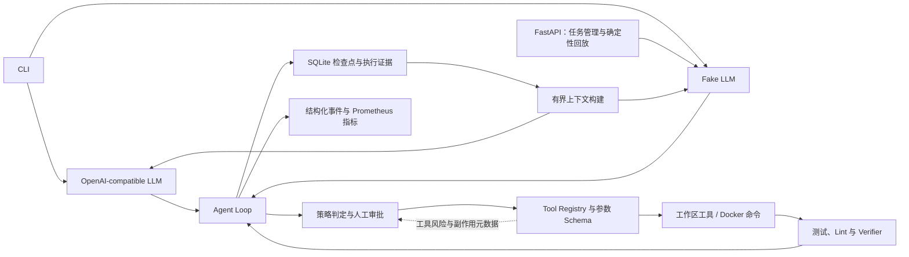

# Reliable Agent Runtime

[](https://github.com/Wilbur-dev/reliable-agent-runtime/actions/workflows/ci.yml)
[](https://www.python.org/)

一个面向工具调用型 LLM Agent 的可靠执行层。系统在明确的权限边界内执行模型选择的动作，独立于模型验证任务是否完成，持久化执行状态，并将循环、失败和越界操作转换为结构化、可审计的运行结果。

项目通过 OpenAI-compatible 接口接入模型，并使用 vLLM 部署的
`Qwen/Qwen2.5-1.5B-Instruct` 完成真实调用实验。同时提供确定性的 Fake LLM 场景，使核心Runtime 无需 GPU 或外部 API 也能进行自动化回归。

## 项目动机

模型声称“已经完成”并不代表软件任务真正完成。一个可控的工具调用 Agent 还需要回答：

- 模型请求的动作是否被允许，并且只在指定工作区内执行？
- 测试和静态检查是否真正通过？
- 服务中断后能否恢复任务，而不重复执行已经生效的补丁？
- 重复动作、连续失败、成本超限和长时间运行能否被及时终止？
- 任务结束后，是否有足够证据解释最终状态和失败原因？

Reliable Agent Runtime 将这些能力放在提示词之外，通过确定性的 Runtime 控制约束模型行为，而不是依赖模型自我检查。

## 系统架构



## 核心能力

| 领域 | 已实现能力 |
|---|---|
| Agent Loop | 结构化模型动作、工具反馈和验证反馈闭环 |
| 工具安全 | Pydantic 参数 Schema、工作区路径边界、受保护路径和命令白名单 |
| 完成验证 | 测试、Lint 和受保护路径 Verifier 独立于模型判定任务成功 |
| 可靠性控制 | 步骤、工具调用、运行时间、Token 和费用预算，以及有限重试和熔断 |
| 失控检测 | 动作指纹、重复动作检测、连续失败熔断和无进展终止 |
| 持久化 | 使用 SQLite 记录任务、步骤、消息、工具执行、产物和验证结果 |
| 中断恢复 | 中断步骤恢复、工作区内容哈希和修改动作幂等键 |
| 策略治理 | 确定性的 `ALLOW`、`DENY`、`REQUIRE_APPROVAL` 判定和步骤级审批 |
| 执行隔离 | 临时非 root Docker 容器、默认断网及 CPU、内存、PID 和超时限制 |
| 上下文管理 | 有界上下文、结构化压缩、大型输出引用和旧文件读取失效检测 |
| 可观测性 | 结构化运行事件、明确终止原因、用量指标和 Prometheus `/metrics` |

## 对照评测

仓库包含 30 项固定任务，覆盖代码理解、配置修复、单文件 Bug、多文件 Bug、故障恢复和安全边界，并在相同任务契约上对比四种配置：

1. Single Call：模型单次回答，不提供工具；
2. Basic Loop：提供工具和多步循环；
3. Guarded Runtime：增加预算和策略控制；
4. Reliable Runtime：启用预算、策略、持久化、上下文管理和验证反馈。

本轮实验共保存 120 条真实模型轨迹。实验没有证明 1.5B 模型的任务解决能力得到显著提升，但验证了评测与失败治理链路：Runtime 能够区分模型的完成声明与外部验证成功，并将重复动作和连续失败转换为明确的终止原因和可追溯证据。

| 验收证据 | 结果 |
|---|---:|
| 固定评测任务 | 30 项 |
| Runtime 对照配置 | 4 种 |
| 真实模型执行轨迹 | 120 条 |
| 完整自动化测试 | 77 项通过 |
| 真实 Docker 隔离测试 | 5 项通过 |

评测材料：

- [Phase 7 技术验收报告](evaluation/results/phase7_acceptance.md)
- [自动生成的 JSON 汇总](evaluation/results/phase7-summary/summary.json)
- [自动生成的 CSV 汇总](evaluation/results/phase7-summary/summary.csv)
- [合并后的原始评测记录](evaluation/results/raw/e4f9b81b1aee45ffb7da22e4503953ad/records.json)
- [评测方法与复现命令](evaluation/README.md)

## 快速开始

要求 Python 3.11 或更高版本。

```bash
python -m pip install -e '.[dev]'
python -m pytest -q
python -m ruff check .
```

运行确定性的只读 Agent 演示：

```bash
reliable-agent \
  --mode readonly \
  --workspace examples/sample_repo \
  --goal 'Find the order discount logic and explain the rules.' \
  --fake-actions examples/phase1_actions.json
```

启动 API：

```bash
uvicorn app.api.main:app --host 127.0.0.1 --port 8080
```

API 支持创建和运行任务、查询步骤与事件、处理审批、查询上下文压缩记录和完整工具结果、取消任务，以及访问健康检查和 Prometheus 指标。

## Docker 部署

```bash
docker compose build runtime
docker compose up -d runtime
curl http://127.0.0.1:8080/health
```

Docker 执行边界用于降低意外影响主机的风险，并使资源限制可复现；它不是面向主动恶意代码的生产级安全沙箱。生产部署仍需增加宿主机加固、镜像来源控制和更强的工作负载隔离。

## 项目结构

```text
app/          CLI 与 FastAPI 控制面
runtime/      Agent Loop、状态模型、预算和上下文管理
tools/        带参数校验的只读与开发工具
verifiers/    确定性完成验证
policies/     允许、拒绝和审批策略
persistence/  SQLite 检查点和恢复记录
sandbox/      受限 Docker 命令执行
evaluator/    任务运行、评分和汇总生成
evaluation/   任务契约、评测方法和实验材料
tests/        单元、Runtime、集成、恢复和隔离测试
```

## 设计与验收文档

- [系统架构](docs/architecture.md)
- [设计决策与权衡](docs/design_decisions.md)
- [Phase 0-1 验收报告](evaluation/results/phase0_phase1_acceptance.md)
- [Phase 2 验收报告](evaluation/results/phase2_acceptance.md)
- [Phase 3 验收报告](evaluation/results/phase3_acceptance.md)
- [Phase 4 验收报告](evaluation/results/phase4_acceptance.md)
- [Phase 5 验收报告](evaluation/results/phase5_acceptance.md)
- [Phase 6 验收报告](evaluation/results/phase6_acceptance.md)
- [Phase 7 验收报告](evaluation/results/phase7_acceptance.md)
